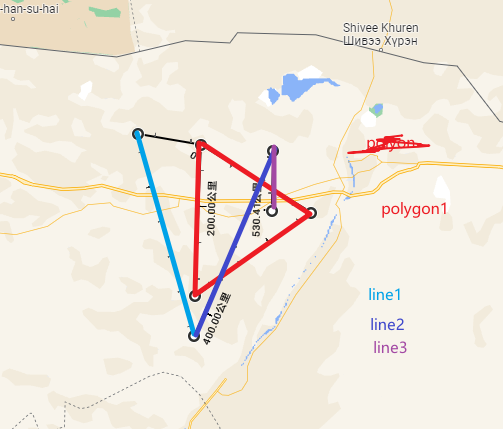
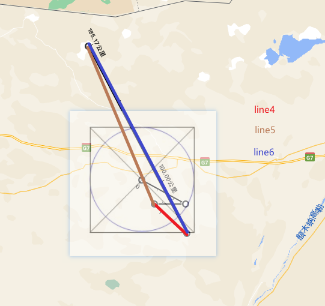
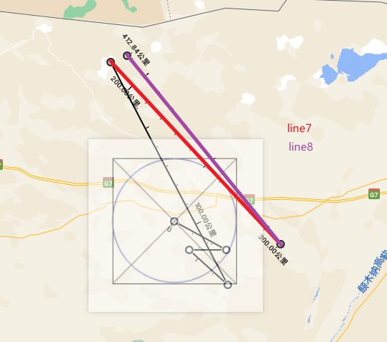

## 说明
### 案例

### 参考
#### 地图标记、坐标选取、测距工具网站

[https://www.google.com/maps/@42.1820514,100.0238753,8.5z](https://www.google.com/maps/@42.1820514,100.0238753,8.5z)

[http://api.map.baidu.com/lbsapi/getpoint/index.html](http://api.map.baidu.com/lbsapi/getpoint/index.html)

[https://map.tianditu.gov.cn/](https://map.tianditu.gov.cn/)

#### 博客
[JTS Java空间几何计算、距离、最近点、subLine等计算\_Archie\_java的博客-CSDN博客\_jts 1.18](https://blog.csdn.net/qq_43842093/article/details/124853910)
[Java中使用JTS对空间几何计算(读取WKT、距离、点在面内、长度、面积、相交等)\_霸道流氓气质的博客-CSDN博客\_jts 计算两点距离](https://blog.csdn.net/BADAO_LIUMANG_QIZHI/article/details/126302894)
[java.awt.geom.Line2D实现线面相交、重叠查询\_朝乾的博客-CSDN博客\_java.awt.geom.line2d](https://blog.csdn.net/weixin_43554160/article/details/116978763)
